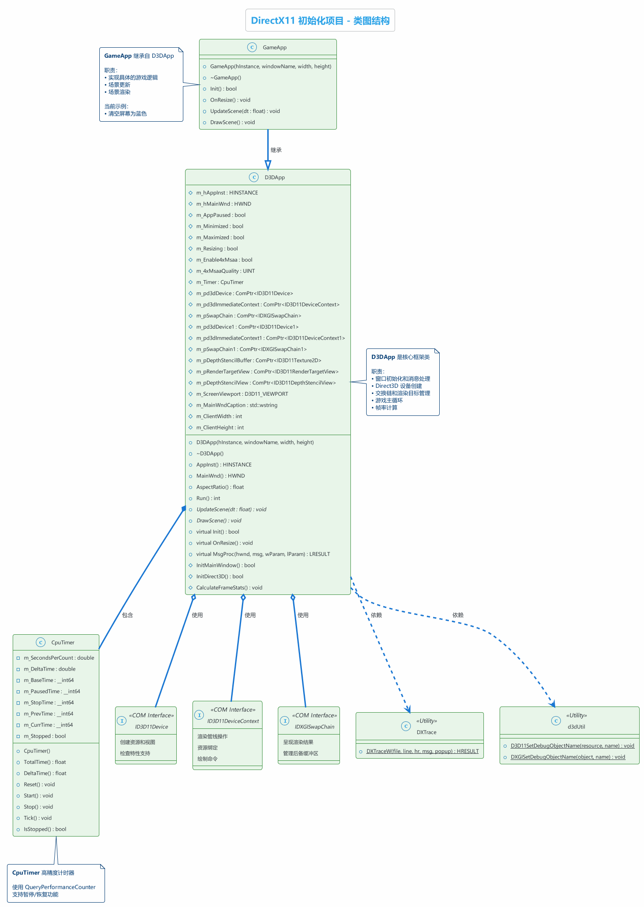
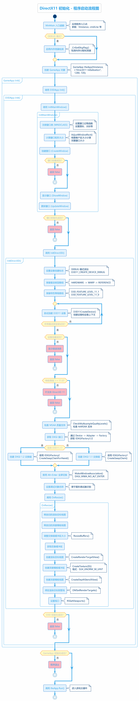
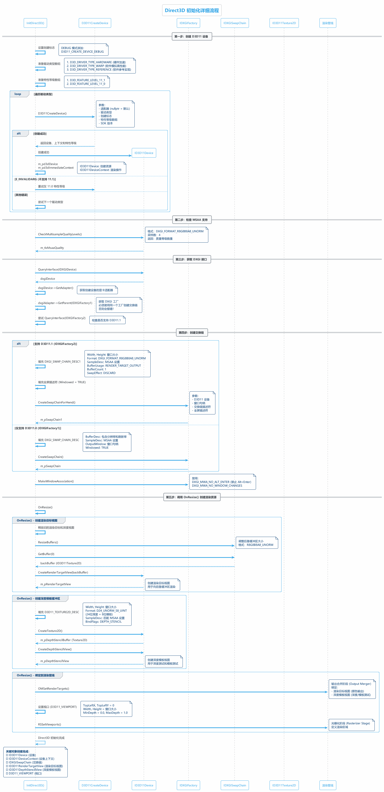
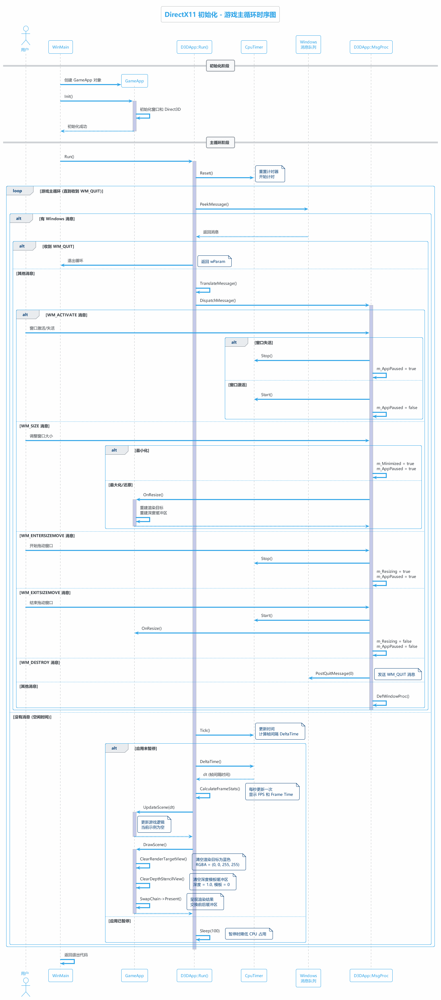
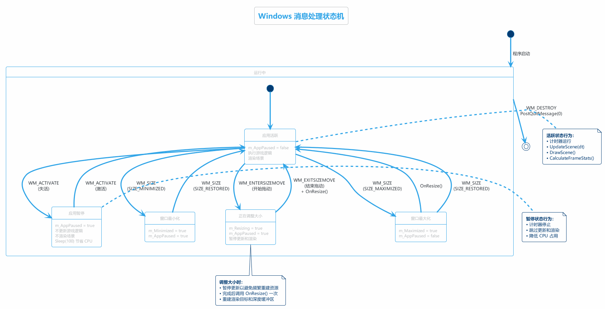
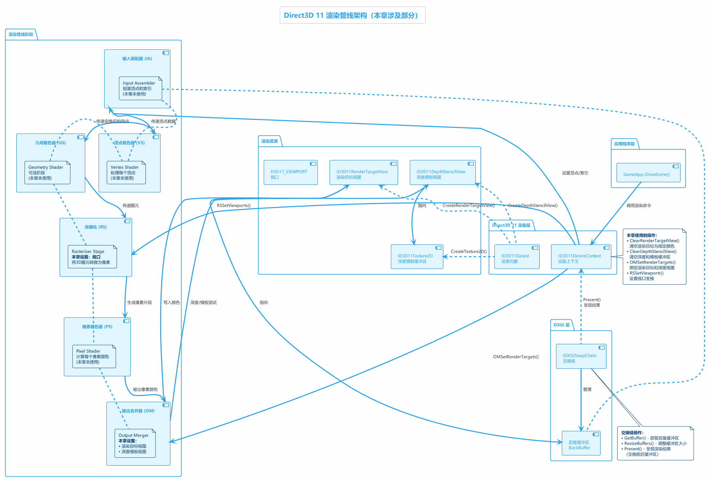

# DirectX11 初始化 - 学习总结

> **项目名称：** 01 DirectX11 Initialization  
> **学习日期：** 2025年11月25日  
> **教程来源：** DirectX11 With Windows SDK  
> **作者：** MKXJun

---

## 📋 目录

- [1. 项目概述](#1-项目概述)
- [2. 项目架构](#2-项目架构)
- [3. 核心类详解](#3-核心类详解)
- [4. 程序初始化流程](#4-程序初始化流程)
- [5. Direct3D 初始化详解](#5-direct3d-初始化详解)
- [6. 游戏主循环](#6-游戏主循环)
- [7. Windows 消息处理](#7-windows-消息处理)
- [8. 渲染管线](#8-渲染管线)
- [9. 关键技术点](#9-关键技术点)
- [10. 学习心得](#10-学习心得)

---

## 1. 项目概述

### 1.1 项目目标

本项目是 DirectX11 系列教程的第一章，主要目标是：

- ✅ 创建 Windows 窗口
- ✅ 初始化 Direct3D 11 设备和设备上下文
- ✅ 创建交换链（Swap Chain）
- ✅ 设置渲染目标视图和深度模板视图
- ✅ 实现基本的游戏主循环
- ✅ 清空屏幕为蓝色（验证渲染管线工作正常）

### 1.2 项目结构

```
01 DirectX11 Initialization/
├── Main.cpp              # 程序入口点（WinMain）
├── GameApp.h/cpp         # 游戏应用类（继承自 D3DApp）
├── d3dApp.h/cpp          # Direct3D 应用框架基类
├── CpuTimer.h/cpp        # 高精度 CPU 计时器
├── d3dUtil.h/cpp         # Direct3D 工具函数
├── DXTrace.h/cpp         # 错误追踪和调试工具
├── WinMin.h              # 精简的 Windows 头文件包含
└── diagrams/             # PlantUML 图表文件夹
    ├── *.puml            # PlantUML 源文件
    └── *.png             # 生成的图片
```

### 1.3 技术栈

- **语言：** C++17
- **图形 API：** Direct3D 11.0/11.1
- **窗口系统：** Win32 API
- **内存管理：** Microsoft::WRL::ComPtr（智能指针）
- **数学库：** DirectXMath

---

## 2. 项目架构

### 2.1 类图结构



### 2.2 核心类关系

项目采用面向对象的设计模式，主要包含以下类：

| 类名 | 职责 | 关系 |
|------|------|------|
| **D3DApp** | Direct3D 应用框架基类 | 抽象基类 |
| **GameApp** | 游戏应用实现类 | 继承 D3DApp |
| **CpuTimer** | 高精度计时器 | D3DApp 包含 |
| **DXTrace** | 错误追踪工具 | 工具类 |
| **d3dUtil** | Direct3D 工具函数 | 工具类 |

**设计模式：**
- **模板方法模式：** D3DApp 定义了应用程序的骨架，GameApp 实现具体细节
- **依赖注入：** 通过构造函数注入窗口参数
- **RAII：** 使用 ComPtr 智能指针自动管理 COM 对象生命周期

---

## 3. 核心类详解

### 3.1 D3DApp 类

**职责：** Direct3D 应用程序框架基类，提供窗口创建、Direct3D 初始化、消息循环等核心功能。

**关键成员变量：**

```cpp
// 窗口相关
HINSTANCE m_hAppInst;           // 应用实例句柄
HWND      m_hMainWnd;           // 主窗口句柄
int       m_ClientWidth;        // 客户区宽度
int       m_ClientHeight;       // 客户区高度

// 应用状态
bool      m_AppPaused;          // 应用是否暂停
bool      m_Minimized;          // 是否最小化
bool      m_Maximized;          // 是否最大化
bool      m_Resizing;           // 是否正在调整大小

// Direct3D 11.0 对象
ComPtr<ID3D11Device>            m_pd3dDevice;           // D3D11 设备
ComPtr<ID3D11DeviceContext>     m_pd3dImmediateContext; // 设备上下文
ComPtr<IDXGISwapChain>          m_pSwapChain;           // 交换链

// Direct3D 11.1 对象（可选）
ComPtr<ID3D11Device1>           m_pd3dDevice1;
ComPtr<ID3D11DeviceContext1>    m_pd3dImmediateContext1;
ComPtr<IDXGISwapChain1>         m_pSwapChain1;

// 渲染资源
ComPtr<ID3D11RenderTargetView>  m_pRenderTargetView;    // 渲染目标视图
ComPtr<ID3D11DepthStencilView>  m_pDepthStencilView;    // 深度模板视图
ComPtr<ID3D11Texture2D>         m_pDepthStencilBuffer;  // 深度模板缓冲区
D3D11_VIEWPORT                  m_ScreenViewport;       // 视口

// MSAA 设置
bool      m_Enable4xMsaa;       // 是否启用 4x MSAA
UINT      m_4xMsaaQuality;      // MSAA 质量等级

// 计时器
CpuTimer  m_Timer;              // 高精度计时器
```

**关键方法：**

```cpp
// 纯虚函数（子类必须实现）
virtual void UpdateScene(float dt) = 0;  // 更新游戏逻辑
virtual void DrawScene() = 0;             // 渲染场景

// 虚函数（子类可选重载）
virtual bool Init();                      // 初始化
virtual void OnResize();                  // 窗口大小变化处理
virtual LRESULT MsgProc(...);             // 消息处理

// 公共方法
int Run();                                // 游戏主循环

// 保护方法
bool InitMainWindow();                    // 初始化窗口
bool InitDirect3D();                      // 初始化 Direct3D
void CalculateFrameStats();               // 计算帧率统计
```

### 3.2 GameApp 类

**职责：** 继承自 D3DApp，实现具体的游戏逻辑。

**当前实现：**

```cpp
bool GameApp::Init()
{
    if (!D3DApp::Init())
        return false;
    return true;
}

void GameApp::UpdateScene(float dt)
{
    // 当前为空，后续章节会添加逻辑
}

void GameApp::DrawScene()
{
    // 清空渲染目标为蓝色
    static float blue[4] = { 0.0f, 0.0f, 1.0f, 1.0f };
    m_pd3dImmediateContext->ClearRenderTargetView(
        m_pRenderTargetView.Get(), blue);
    
    // 清空深度模板缓冲区
    m_pd3dImmediateContext->ClearDepthStencilView(
        m_pDepthStencilView.Get(), 
        D3D11_CLEAR_DEPTH | D3D11_CLEAR_STENCIL, 
        1.0f, 0);
    
    // 呈现渲染结果
    HR(m_pSwapChain->Present(0, 0));
}
```

### 3.3 CpuTimer 类

**职责：** 提供高精度计时功能，用于计算帧间隔时间和总运行时间。

**实现原理：**
- 使用 Windows API `QueryPerformanceCounter()` 获取高精度时间戳
- 支持暂停/恢复功能
- 计算帧间隔 DeltaTime 用于游戏逻辑更新

**关键方法：**

```cpp
void Reset();            // 重置计时器
void Start();            // 开始/恢复计时
void Stop();             // 暂停计时
void Tick();             // 每帧调用，更新时间
float TotalTime();       // 获取总运行时间（不含暂停）
float DeltaTime();       // 获取帧间隔时间
```

---

## 4. 程序初始化流程

### 4.1 完整流程图



### 4.2 初始化步骤详解

#### 步骤 1：WinMain 入口

```cpp
int WINAPI WinMain(HINSTANCE hInstance, ...)
{
    // Debug 模式启用内存泄漏检测
#if defined(DEBUG) | defined(_DEBUG)
    _CrtSetDbgFlag(_CRTDBG_ALLOC_MEM_DF | _CRTDBG_LEAK_CHECK_DF);
#endif

    // 创建 GameApp 对象
    GameApp theApp(hInstance, L"DirectX11 Initialization", 1280, 720);

    // 初始化应用
    if (!theApp.Init())
        return 0;

    // 运行游戏主循环
    return theApp.Run();
}
```

#### 步骤 2：窗口初始化 (InitMainWindow)

1. **注册窗口类 (WNDCLASS)**
   ```cpp
   WNDCLASS wc;
   wc.style         = CS_HREDRAW | CS_VREDRAW;  // 窗口样式
   wc.lpfnWndProc   = MainWndProc;              // 消息处理函数
   wc.hInstance     = m_hAppInst;
   wc.hIcon         = LoadIcon(0, IDI_APPLICATION);
   wc.hCursor       = LoadCursor(0, IDC_ARROW);
   wc.lpszClassName = L"D3DWndClassName";
   RegisterClass(&wc);
   ```

2. **计算窗口大小**
   ```cpp
   RECT R = { 0, 0, m_ClientWidth, m_ClientHeight };
   AdjustWindowRect(&R, WS_OVERLAPPEDWINDOW, false);
   // 根据客户区大小计算包含边框的完整窗口大小
   ```

3. **创建窗口**
   ```cpp
   m_hMainWnd = CreateWindow(
       L"D3DWndClassName",
       m_MainWndCaption.c_str(),
       WS_OVERLAPPEDWINDOW,
       CW_USEDEFAULT, CW_USEDEFAULT,
       width, height,
       nullptr, nullptr, m_hAppInst, nullptr);
   ```

4. **显示窗口**
   ```cpp
   ShowWindow(m_hMainWnd, SW_SHOW);
   UpdateWindow(m_hMainWnd);
   ```

#### 步骤 3：Direct3D 初始化 (InitDirect3D)

详见第 5 节。

---


## 5. Direct3D 初始化详解

### 5.1 初始化流程图



### 5.2 创建 D3D11 设备

**目标：** 创建 ID3D11Device 和 ID3D11DeviceContext

```cpp
// 设置创建标志
UINT createDeviceFlags = 0;
#if defined(DEBUG) || defined(_DEBUG)
    createDeviceFlags |= D3D11_CREATE_DEVICE_DEBUG;  // Debug 模式
#endif

// 驱动类型数组（按优先级）
D3D_DRIVER_TYPE driverTypes[] = {
    D3D_DRIVER_TYPE_HARDWARE,    // 硬件加速（优先）
    D3D_DRIVER_TYPE_WARP,        // 高性能软件渲染
    D3D_DRIVER_TYPE_REFERENCE,   // 参考实现（最慢）
};

// 特性等级数组
D3D_FEATURE_LEVEL featureLevels[] = {
    D3D_FEATURE_LEVEL_11_1,      // Direct3D 11.1
    D3D_FEATURE_LEVEL_11_0,      // Direct3D 11.0
};

// 尝试创建设备
for (UINT i = 0; i < numDriverTypes; i++)
{
    hr = D3D11CreateDevice(
        nullptr,                  // 默认适配器
        driverTypes[i],           // 驱动类型
        nullptr,                  // 软件模块句柄
        createDeviceFlags,        // 创建标志
        featureLevels,            // 特性等级数组
        numFeatureLevels,         // 数组大小
        D3D11_SDK_VERSION,        // SDK 版本
        &m_pd3dDevice,            // 输出：设备
        &featureLevel,            // 输出：实际特性等级
        &m_pd3dImmediateContext   // 输出：设备上下文
    );
    
    if (SUCCEEDED(hr))
        break;
}
```

**重要概念：**

- **ID3D11Device：** 用于创建资源（缓冲区、纹理、着色器等）
- **ID3D11DeviceContext：** 用于渲染操作（设置管线状态、绘制调用等）
- **特性等级：** 表示 GPU 支持的功能集合
- **驱动类型：** HARDWARE（最快）> WARP（软件高性能）> REFERENCE（参考实现）

### 5.3 检查 MSAA 支持

**多重采样抗锯齿 (MSAA)：** 通过对每个像素采样多次来减少锯齿。

```cpp
// 检查 4x MSAA 的质量等级
m_pd3dDevice->CheckMultisampleQualityLevels(
    DXGI_FORMAT_R8G8B8A8_UNORM,  // 格式
    4,                            // 采样数
    &m_4xMsaaQuality             // 输出：质量等级数
);

// m_4xMsaaQuality - 1 是最高质量等级
```

### 5.4 获取 DXGI 接口

**关键点：** 必须使用创建设备的同一个 DXGI 工厂来创建交换链！

```cpp
ComPtr<IDXGIDevice> dxgiDevice;
ComPtr<IDXGIAdapter> dxgiAdapter;
ComPtr<IDXGIFactory1> dxgiFactory1;
ComPtr<IDXGIFactory2> dxgiFactory2;

// 1. Device -> IDXGIDevice
m_pd3dDevice.As(&dxgiDevice);

// 2. IDXGIDevice -> Adapter
dxgiDevice->GetAdapter(&dxgiAdapter);

// 3. Adapter -> Factory
dxgiAdapter->GetParent(__uuidof(IDXGIFactory1), 
                       (void**)&dxgiFactory1);

// 4. 检查是否支持 DXGI 1.2 (D3D11.1)
hr = dxgiFactory1.As(&dxgiFactory2);
```

### 5.5 创建交换链

**交换链 (Swap Chain)：** 管理前后缓冲区，实现双缓冲渲染。

#### 5.5.1 Direct3D 11.1 方式 (推荐)

```cpp
// 填充交换链描述符
DXGI_SWAP_CHAIN_DESC1 sd;
ZeroMemory(&sd, sizeof(sd));
sd.Width        = m_ClientWidth;
sd.Height       = m_ClientHeight;
sd.Format       = DXGI_FORMAT_R8G8B8A8_UNORM;  // 8位RGBA
sd.SampleDesc.Count   = m_Enable4xMsaa ? 4 : 1;
sd.SampleDesc.Quality = m_Enable4xMsaa ? (m_4xMsaaQuality - 1) : 0;
sd.BufferUsage  = DXGI_USAGE_RENDER_TARGET_OUTPUT;
sd.BufferCount  = 1;                           // 单后备缓冲区
sd.SwapEffect   = DXGI_SWAP_EFFECT_DISCARD;    // 呈现后丢弃

// 全屏描述符
DXGI_SWAP_CHAIN_FULLSCREEN_DESC fd;
fd.RefreshRate.Numerator   = 60;
fd.RefreshRate.Denominator = 1;
fd.Windowed = TRUE;                            // 窗口模式

// 创建交换链
dxgiFactory2->CreateSwapChainForHwnd(
    m_pd3dDevice.Get(),
    m_hMainWnd,
    &sd, &fd, nullptr,
    &m_pSwapChain1
);
```

#### 5.5.2 Direct3D 11.0 方式

```cpp
DXGI_SWAP_CHAIN_DESC sd;
ZeroMemory(&sd, sizeof(sd));
sd.BufferDesc.Width  = m_ClientWidth;
sd.BufferDesc.Height = m_ClientHeight;
sd.BufferDesc.Format = DXGI_FORMAT_R8G8B8A8_UNORM;
sd.BufferDesc.RefreshRate.Numerator   = 60;
sd.BufferDesc.RefreshRate.Denominator = 1;
sd.SampleDesc.Count   = m_Enable4xMsaa ? 4 : 1;
sd.SampleDesc.Quality = m_Enable4xMsaa ? (m_4xMsaaQuality - 1) : 0;
sd.BufferUsage  = DXGI_USAGE_RENDER_TARGET_OUTPUT;
sd.BufferCount  = 1;
sd.OutputWindow = m_hMainWnd;
sd.Windowed     = TRUE;
sd.SwapEffect   = DXGI_SWAP_EFFECT_DISCARD;

dxgiFactory1->CreateSwapChain(m_pd3dDevice.Get(), &sd, &m_pSwapChain);
```

### 5.6 禁用 Alt+Enter 全屏切换

```cpp
dxgiFactory1->MakeWindowAssociation(
    m_hMainWnd, 
    DXGI_MWA_NO_ALT_ENTER | DXGI_MWA_NO_WINDOW_CHANGES
);
```

### 5.7 创建渲染资源 (OnResize)

#### 5.7.1 创建渲染目标视图

```cpp
// 1. 调整交换链缓冲区大小
m_pSwapChain->ResizeBuffers(
    1,                            // 缓冲区数量
    m_ClientWidth, m_ClientHeight,
    DXGI_FORMAT_R8G8B8A8_UNORM,
    0
);

// 2. 获取后备缓冲区
ComPtr<ID3D11Texture2D> backBuffer;
m_pSwapChain->GetBuffer(0, __uuidof(ID3D11Texture2D), 
                        (void**)&backBuffer);

// 3. 创建渲染目标视图
m_pd3dDevice->CreateRenderTargetView(
    backBuffer.Get(), 
    nullptr,  // 默认描述符
    &m_pRenderTargetView
);
```

#### 5.7.2 创建深度模板缓冲区

```cpp
// 1. 填充纹理描述符
D3D11_TEXTURE2D_DESC depthStencilDesc;
depthStencilDesc.Width     = m_ClientWidth;
depthStencilDesc.Height    = m_ClientHeight;
depthStencilDesc.MipLevels = 1;
depthStencilDesc.ArraySize = 1;
depthStencilDesc.Format    = DXGI_FORMAT_D24_UNORM_S8_UINT;  // 24位深度+8位模板
depthStencilDesc.SampleDesc.Count   = m_Enable4xMsaa ? 4 : 1;
depthStencilDesc.SampleDesc.Quality = m_Enable4xMsaa ? (m_4xMsaaQuality - 1) : 0;
depthStencilDesc.Usage      = D3D11_USAGE_DEFAULT;
depthStencilDesc.BindFlags  = D3D11_BIND_DEPTH_STENCIL;
depthStencilDesc.CPUAccessFlags = 0;
depthStencilDesc.MiscFlags  = 0;

// 2. 创建深度模板缓冲区纹理
m_pd3dDevice->CreateTexture2D(
    &depthStencilDesc, 
    nullptr, 
    &m_pDepthStencilBuffer
);

// 3. 创建深度模板视图
m_pd3dDevice->CreateDepthStencilView(
    m_pDepthStencilBuffer.Get(), 
    nullptr, 
    &m_pDepthStencilView
);
```

#### 5.7.3 绑定到渲染管线

```cpp
// 绑定渲染目标和深度模板视图到输出合并阶段
m_pd3dImmediateContext->OMSetRenderTargets(
    1,                          // 渲染目标数量
    &m_pRenderTargetView,       // 渲染目标视图数组
    m_pDepthStencilView.Get()   // 深度模板视图
);
```

#### 5.7.4 设置视口

```cpp
// 配置视口
m_ScreenViewport.TopLeftX = 0;
m_ScreenViewport.TopLeftY = 0;
m_ScreenViewport.Width    = static_cast<float>(m_ClientWidth);
m_ScreenViewport.Height   = static_cast<float>(m_ClientHeight);
m_ScreenViewport.MinDepth = 0.0f;  // 最近深度
m_ScreenViewport.MaxDepth = 1.0f;  // 最远深度

// 绑定视口到光栅化阶段
m_pd3dImmediateContext->RSSetViewports(1, &m_ScreenViewport);
```

**视口作用：** 定义 NDC 坐标 [-1, 1] 到屏幕坐标的映射。

---


## 6. 游戏主循环

### 6.1 主循环时序图



### 6.2 Run() 函数实现

```cpp
int D3DApp::Run()
{
    MSG msg = { 0 };
    m_Timer.Reset();  // 重置计时器

    while (msg.message != WM_QUIT)
    {
        // 检查是否有 Windows 消息
        if (PeekMessage(&msg, 0, 0, 0, PM_REMOVE))
        {
            TranslateMessage(&msg);  // 转换键盘消息
            DispatchMessage(&msg);   // 分发到窗口过程函数
        }
        else  // 没有消息，执行游戏逻辑
        {
            m_Timer.Tick();  // 更新计时器

            if (!m_AppPaused)
            {
                CalculateFrameStats();        // 计算帧率
                UpdateScene(m_Timer.DeltaTime());  // 更新逻辑
                DrawScene();                   // 渲染场景
            }
            else
            {
                Sleep(100);  // 暂停时降低 CPU 占用
            }
        }
    }

    return (int)msg.wParam;
}
```

### 6.3 帧率统计

```cpp
void D3DApp::CalculateFrameStats()
{
    static int frameCnt = 0;
    static float timeElapsed = 0.0f;

    frameCnt++;

    // 每秒更新一次统计
    if ((m_Timer.TotalTime() - timeElapsed) >= 1.0f)
    {
        float fps = (float)frameCnt;      // FPS = 帧数 / 1秒
        float mspf = 1000.0f / fps;       // 每帧毫秒数

        std::wostringstream outs;
        outs.precision(6);
        outs << m_MainWndCaption << L"    "
             << L"FPS: " << fps << L"    "
             << L"Frame Time: " << mspf << L" (ms)";
        SetWindowText(m_hMainWnd, outs.str().c_str());

        frameCnt = 0;
        timeElapsed += 1.0f;
    }
}
```

### 6.4 渲染流程

```cpp
void GameApp::DrawScene()
{
    assert(m_pd3dImmediateContext);
    assert(m_pSwapChain);

    // 1. 清空渲染目标为蓝色
    static float blue[4] = { 0.0f, 0.0f, 1.0f, 1.0f };  // RGBA
    m_pd3dImmediateContext->ClearRenderTargetView(
        m_pRenderTargetView.Get(), 
        blue
    );

    // 2. 清空深度模板缓冲区
    m_pd3dImmediateContext->ClearDepthStencilView(
        m_pDepthStencilView.Get(),
        D3D11_CLEAR_DEPTH | D3D11_CLEAR_STENCIL,  // 清空深度和模板
        1.0f,  // 深度值设为 1.0（最远）
        0      // 模板值设为 0
    );

    // 3. （此处应有绘制调用，当前示例为空）

    // 4. 呈现渲染结果（交换前后缓冲区）
    HR(m_pSwapChain->Present(0, 0));
    // 参数1: 同步间隔 (0 = 立即呈现, 1 = 等待垂直同步)
    // 参数2: 呈现标志
}
```

**关键点：**
- `ClearRenderTargetView()` 清空颜色缓冲区
- `ClearDepthStencilView()` 清空深度和模板缓冲区
- `Present()` 交换前后缓冲区，显示渲染结果

---

## 7. Windows 消息处理

### 7.1 消息处理状态机



### 7.2 关键消息处理

#### WM_ACTIVATE - 窗口激活/失活

```cpp
case WM_ACTIVATE:
    if (LOWORD(wParam) == WA_INACTIVE)
    {
        m_AppPaused = true;   // 窗口失活，暂停应用
        m_Timer.Stop();       // 停止计时器
    }
    else
    {
        m_AppPaused = false;  // 窗口激活，恢复应用
        m_Timer.Start();      // 启动计时器
    }
    return 0;
```

**作用：** 窗口失去焦点时自动暂停游戏，节省资源。

#### WM_SIZE - 窗口大小改变

```cpp
case WM_SIZE:
    m_ClientWidth  = LOWORD(lParam);
    m_ClientHeight = HIWORD(lParam);
    
    if (m_pd3dDevice)
    {
        if (wParam == SIZE_MINIMIZED)  // 最小化
        {
            m_AppPaused = true;
            m_Minimized = true;
            m_Maximized = false;
        }
        else if (wParam == SIZE_MAXIMIZED)  // 最大化
        {
            m_AppPaused = false;
            m_Minimized = false;
            m_Maximized = true;
            OnResize();  // 重建渲染资源
        }
        else if (wParam == SIZE_RESTORED)  // 还原
        {
            if (m_Minimized)  // 从最小化还原
            {
                m_AppPaused = false;
                m_Minimized = false;
                OnResize();
            }
            else if (m_Maximized)  // 从最大化还原
            {
                m_AppPaused = false;
                m_Maximized = false;
                OnResize();
            }
            else if (m_Resizing)
            {
                // 正在拖动，不重建（避免频繁调用）
            }
            else  // API 调用改变大小
            {
                OnResize();
            }
        }
    }
    return 0;
```

#### WM_ENTERSIZEMOVE / WM_EXITSIZEMOVE - 调整大小

```cpp
case WM_ENTERSIZEMOVE:  // 开始拖动窗口边框
    m_AppPaused = true;
    m_Resizing = true;
    m_Timer.Stop();
    return 0;

case WM_EXITSIZEMOVE:   // 结束拖动窗口边框
    m_AppPaused = false;
    m_Resizing = false;
    m_Timer.Start();
    OnResize();  // 一次性重建渲染资源
    return 0;
```

**优化：** 拖动时暂停重建，释放后统一重建，避免频繁操作。

#### WM_DESTROY - 窗口销毁

```cpp
case WM_DESTROY:
    PostQuitMessage(0);  // 发送 WM_QUIT 消息
    return 0;
```

#### WM_GETMINMAXINFO - 限制窗口最小尺寸

```cpp
case WM_GETMINMAXINFO:
    ((MINMAXINFO*)lParam)->ptMinTrackSize.x = 200;
    ((MINMAXINFO*)lParam)->ptMinTrackSize.y = 200;
    return 0;
```

---

## 8. 渲染管线

### 8.1 渲染管线架构图



### 8.2 Direct3D 11 渲染管线阶段

| 阶段 | 英文名 | 可编程 | 本章使用 | 说明 |
|------|--------|--------|----------|------|
| **IA** | Input Assembler | ❌ | ❌ | 输入装配器：组装顶点和索引数据 |
| **VS** | Vertex Shader | ✅ | ❌ | 顶点着色器：处理每个顶点 |
| **HS** | Hull Shader | ✅ | ❌ | 外壳着色器：曲面细分控制 |
| **TS** | Tessellator | ❌ | ❌ | 曲面细分器：生成新顶点 |
| **DS** | Domain Shader | ✅ | ❌ | 域着色器：处理细分后的顶点 |
| **GS** | Geometry Shader | ✅ | ❌ | 几何着色器：处理整个图元 |
| **SO** | Stream Output | ❌ | ❌ | 流输出：将数据写回缓冲区 |
| **RS** | Rasterizer Stage | ❌ | ✅ | 光栅化：3D图元转2D像素 |
| **PS** | Pixel Shader | ✅ | ❌ | 像素着色器：计算像素颜色 |
| **OM** | Output Merger | ❌ | ✅ | 输出合并：深度测试、混合 |

### 8.3 本章涉及的管线操作

#### 8.3.1 输出合并阶段 (OM)

```cpp
// 绑定渲染目标和深度模板视图
m_pd3dImmediateContext->OMSetRenderTargets(
    1,                           // 渲染目标数量
    &m_pRenderTargetView,        // 渲染目标视图数组
    m_pDepthStencilView.Get()    // 深度模板视图
);
```

**作用：**
- 设置像素着色器输出的目标
- 启用深度测试和模板测试

#### 8.3.2 光栅化阶段 (RS)

```cpp
// 设置视口
m_pd3dImmediateContext->RSSetViewports(1, &m_ScreenViewport);
```

**作用：**
- 定义渲染区域
- 将 NDC 坐标映射到屏幕坐标

### 8.4 双缓冲机制

```
      
  前缓冲区   ◄  后缓冲区   
 (显示器显示)  Present()  (渲染目标) 
      
                           
                           
      交换
```

**工作流程：**
1. 渲染到后缓冲区
2. 调用 `Present()` 交换前后缓冲区
3. 显示器显示新的前缓冲区
4. 继续渲染到新的后缓冲区

**优点：** 避免画面撕裂（Tearing）

---


## 9. 关键技术点

### 9.1 COM 智能指针 (ComPtr)

**Microsoft::WRL::ComPtr** 是专为 COM 对象设计的智能指针，自动管理引用计数。

```cpp
// 传统方式（需要手动 Release）
ID3D11Device* device = nullptr;
// ... 使用 device ...
if (device) {
    device->Release();
    device = nullptr;
}

// ComPtr 方式（自动管理）
ComPtr<ID3D11Device> device;
// ... 使用 device ...
// 析构时自动调用 Release()
```

**常用方法：**
```cpp
ComPtr<ID3D11Device> device;

device.Get();              // 获取原始指针
device.GetAddressOf();     // 获取指针地址（用于输出参数）
device.Reset();            // 释放并置空
device.As(&other);         // QueryInterface 转换
```

### 9.2 错误处理 (HR 宏)

**HR 宏定义：**
```cpp
#if defined(DEBUG) | defined(_DEBUG)
    #define HR(x) \
    { \
        HRESULT hr = (x); \
        if(FAILED(hr)) \
        { \
            DXTraceW(__FILEW__, (DWORD)__LINE__, hr, L#x, true); \
        } \
    }
#else
    #define HR(x) (x)
#endif
```

**用法：**
```cpp
// Debug 模式：失败时弹出错误对话框并显示文件名、行号、错误码
HR(m_pd3dDevice->CreateTexture2D(&desc, nullptr, &texture));

// Release 模式：直接调用，不做检查
```

### 9.3 图形调试器对象命名

**作用：** 在 Visual Studio 图形调试器中显示友好的对象名称。

```cpp
// 设置 D3D11 对象名称
D3D11SetDebugObjectName(m_pd3dDevice.Get(), "MainDevice");
D3D11SetDebugObjectName(backBuffer.Get(), "BackBuffer[0]");

// 设置 DXGI 对象名称
DXGISetDebugObjectName(m_pSwapChain.Get(), "SwapChain");
```

**好处：**
- 在图形调试器中快速识别对象
- 诊断资源泄漏时更清晰
- 多人协作时提高可读性

### 9.4 多重采样抗锯齿 (MSAA)

**工作原理：** 对每个像素采样多次，然后平均，减少锯齿效果。

```
无 MSAA:        4x MSAA:
            
              每个像素细分为 4 个子采样点
              根据覆盖情况计算最终颜色
               
               
```

**性能影响：**
- 4x MSAA  性能降低 20-30%
- 8x MSAA  性能降低 40-50%
- 对填充率（Fill Rate）影响大

**使用建议：**
- 桌面应用：2x 或 4x
- 移动设备：关闭或 2x
- 高端游戏：可选 8x

### 9.5 深度模板格式选择

| 格式 | 深度位 | 模板位 | 总位数 | 说明 |
|------|--------|--------|--------|------|
| **D24_UNORM_S8_UINT** | 24 | 8 | 32 | ✅ 最常用，本项目使用 |
| **D32_FLOAT** | 32 | 0 | 32 | 高精度深度，无模板 |
| **D32_FLOAT_S8X24_UINT** | 32 | 8 | 64 | 最高精度，占用大 |
| **D16_UNORM** | 16 | 0 | 16 | 移动设备常用 |

**选择建议：**
- 一般应用：D24_UNORM_S8_UINT（本章使用）
- 需要高精度深度：D32_FLOAT
- 需要模板操作：包含 S8 的格式
- 内存受限：D16_UNORM

### 9.6 视口变换

**NDC 到屏幕坐标的映射：**

```
NDC 坐标 (-1, 1)          屏幕坐标 (0, 0)
                    
                                  
       +      >       +   
                                  
                    
NDC 坐标 (1, -1)          屏幕坐标 (width, height)

深度：NDC [0, 1] -> 视口 [MinDepth, MaxDepth]
```

**视口公式：**
```
ScreenX = (NDCX + 1) * Width / 2 + TopLeftX
ScreenY = (1 - NDCY) * Height / 2 + TopLeftY
ScreenZ = NDCZ * (MaxDepth - MinDepth) + MinDepth
```

### 9.7 特性等级 (Feature Level)

**Direct3D 11 特性等级：**

| 等级 | 着色器模型 | 最大纹理尺寸 | 几何着色器 | 曲面细分 |
|------|------------|--------------|------------|----------|
| **11_1** | 5.0 | 16384 | ✅ | ✅ |
| **11_0** | 5.0 | 16384 | ✅ | ✅ |
| **10_1** | 4.1 | 8192 | ✅ | ❌ |
| **10_0** | 4.0 | 8192 | ✅ | ❌ |
| **9_3** | 2.0/3.0 | 4096 | ❌ | ❌ |

**本项目要求：** 至少 Feature Level 11.0

---

## 10. 学习心得

### 10.1 核心要点总结

#### ✅ 必须掌握的概念

1. **D3D11 设备和设备上下文的区别**
   - Device：创建资源
   - DeviceContext：执行渲染命令

2. **交换链的作用**
   - 管理前后缓冲区
   - 实现双缓冲渲染
   - 呈现渲染结果

3. **渲染目标和深度模板的配置**
   - RTV：颜色输出
   - DSV：深度测试和模板测试

4. **游戏主循环的设计**
   - 消息处理
   - 游戏逻辑更新
   - 场景渲染

5. **窗口消息处理**
   - 窗口状态管理
   - 资源重建时机

### 10.2 常见问题与解决方案

#### 问题1：创建设备失败

**症状：** `D3D11CreateDevice()` 返回错误

**可能原因：**
- 显卡不支持 Direct3D 11
- 驱动程序过旧
- Debug 模式但未安装 DirectX SDK

**解决方案：**
- 更新显卡驱动
- 降低特性等级要求
- Release 模式去掉 DEBUG 标志

#### 问题2：窗口调整大小后黑屏

**症状：** 改变窗口大小后渲染失败

**可能原因：**
- 未调用 `OnResize()`
- 未正确释放旧的渲染目标
- 未重新绑定渲染目标到管线

**解决方案：**
```cpp
// 正确的 OnResize 顺序：
1. 释放渲染目标和深度视图
2. ResizeBuffers()
3. 重新创建渲染目标视图
4. 重新创建深度模板视图和缓冲区
5. 绑定到管线
6. 更新视口
```

#### 问题3：内存泄漏

**症状：** 程序退出时报告内存泄漏

**可能原因：**
- COM 对象未释放
- ComPtr 使用不当
- 循环引用

**解决方案：**
- 使用 ComPtr 管理所有 COM 对象
- 确保析构函数正确
- Debug 模式启用泄漏检测：
```cpp
_CrtSetDbgFlag(_CRTDBG_ALLOC_MEM_DF | _CRTDBG_LEAK_CHECK_DF);
```

### 10.3 优化建议

#### 性能优化

1. **MSAA 设置**
   - 根据目标平台选择合适的采样数
   - 提供配置选项让用户选择

2. **垂直同步**
   - `Present(1, 0)` 启用 VSync（60 FPS）
   - `Present(0, 0)` 禁用 VSync（无限帧率）

3. **窗口调整优化**
   - 拖动时暂停重建（已实现）
   - 考虑使用固定分辨率缩放

#### 代码组织

1. **职责分离**
   - D3DApp：框架代码
   - GameApp：游戏逻辑
   - 工具类：独立功能

2. **错误处理**
   - 统一使用 HR 宏
   - 添加详细的错误信息

3. **资源管理**
   - 使用 ComPtr 自动管理
   - RAII 原则

### 10.4 后续学习方向

本章完成了 Direct3D 的基础初始化，后续章节将学习：

- ✏️ **第2章：** 渲染三角形（顶点缓冲区、着色器）
- ✏️ **第3章：** 渲染立方体（索引缓冲区、常量缓冲区）
- ✏️ **第6章：** ImGui 集成（UI 系统）
- ✏️ **第7章：** 光照（光照模型、法线）
- ✏️ **第9章：** 纹理映射（采样器、纹理坐标）
- ✏️ **第10章：** 摄像机（视图矩阵、投影矩阵）

### 10.5 参考资源

**官方文档：**
- [Microsoft Direct3D 11 文档](https://docs.microsoft.com/en-us/windows/win32/direct3d11/atoc-dx-graphics-direct3d-11)
- [MSDN Direct3D 11 API 参考](https://docs.microsoft.com/en-us/windows/win32/direct3d11/d3d11-graphics-reference)

**推荐书籍：**
- 《Introduction to 3D Game Programming with DirectX 11》 - Frank Luna
- 《Real-Time Rendering》 - Tomas Akenine-Möller

**在线教程：**
- [本教程 GitHub](https://github.com/MKXJun/DirectX11-With-Windows-SDK)
- [在线教程](https://mkxjun.github.io/DirectX11-With-Windows-SDK-Book)

---

## 附录：完整代码清单

### A.1 Main.cpp

```cpp
#include "GameApp.h"

int WINAPI WinMain(_In_ HINSTANCE hInstance, _In_opt_ HINSTANCE prevInstance,
    _In_ LPSTR cmdLine, _In_ int showCmd)
{
    UNREFERENCED_PARAMETER(prevInstance);
    UNREFERENCED_PARAMETER(cmdLine);
    UNREFERENCED_PARAMETER(showCmd);

#if defined(DEBUG) | defined(_DEBUG)
    _CrtSetDbgFlag(_CRTDBG_ALLOC_MEM_DF | _CRTDBG_LEAK_CHECK_DF);
#endif

    GameApp theApp(hInstance, L"DirectX11 Initialization", 1280, 720);

    if (!theApp.Init())
        return 0;

    return theApp.Run();
}
```

### A.2 关键数据结构

```cpp
// DXGI 交换链描述符 (D3D11.1)
struct DXGI_SWAP_CHAIN_DESC1 {
    UINT Width;                    // 缓冲区宽度
    UINT Height;                   // 缓冲区高度
    DXGI_FORMAT Format;            // 像素格式
    BOOL Stereo;                   // 立体声
    DXGI_SAMPLE_DESC SampleDesc;   // 多重采样
    DXGI_USAGE BufferUsage;        // 缓冲区用途
    UINT BufferCount;              // 缓冲区数量
    DXGI_SCALING Scaling;          // 缩放模式
    DXGI_SWAP_EFFECT SwapEffect;   // 交换效果
    DXGI_ALPHA_MODE AlphaMode;     // Alpha 模式
    UINT Flags;                    // 标志
};

// 纹理2D描述符
struct D3D11_TEXTURE2D_DESC {
    UINT Width;                    // 宽度
    UINT Height;                   // 高度
    UINT MipLevels;                // Mipmap 级别
    UINT ArraySize;                // 数组大小
    DXGI_FORMAT Format;            // 像素格式
    DXGI_SAMPLE_DESC SampleDesc;   // 多重采样
    D3D11_USAGE Usage;             // 用途
    UINT BindFlags;                // 绑定标志
    UINT CPUAccessFlags;           // CPU 访问标志
    UINT MiscFlags;                // 其他标志
};

// 视口
struct D3D11_VIEWPORT {
    FLOAT TopLeftX;    // 左上角 X
    FLOAT TopLeftY;    // 左上角 Y
    FLOAT Width;       // 宽度
    FLOAT Height;      // 高度
    FLOAT MinDepth;    // 最小深度 (0.0)
    FLOAT MaxDepth;    // 最大深度 (1.0)
};
```

---

## 结语

通过本章学习，我们成功搭建了 DirectX11 应用程序的基础框架，完成了：

✅ Windows 窗口创建  
✅ Direct3D 11 设备初始化  
✅ 交换链和渲染资源配置  
✅ 游戏主循环实现  
✅ Windows 消息处理  
✅ 基础渲染（清屏）

这个框架将作为后续所有章节的基础，建议多次运行和调试，深入理解每个步骤的作用。

**下一章预告：** 渲染三角形 - 学习顶点缓冲区、顶点着色器和像素着色器的使用。

---

**文档生成日期：** 2025年11月25日  
**PlantUML 图表：** 6 张（类图、流程图、时序图、状态图、架构图）  
**代码示例：** 完整且可运行  
**适用人群：** DirectX11 初学者

---

© 2025 学习总结 | 基于 MKXJun 的 DirectX11 With Windows SDK 教程

